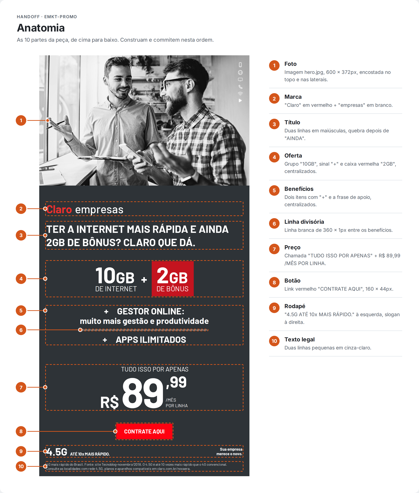
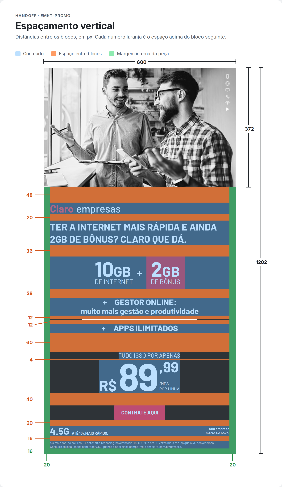
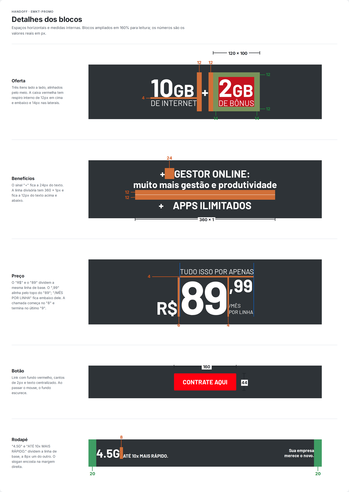
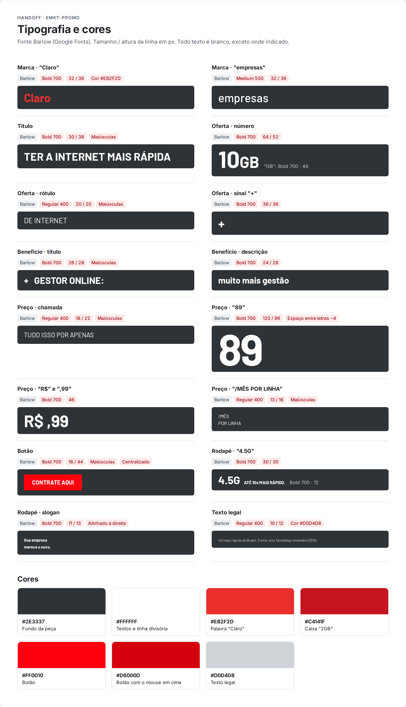

# Desafio emkt-promo: do GitHub ao HTML/CSS

## Como funciona

Vocês vão sair do zero e publicar no GitHub uma peça de email marketing feita só com HTML e CSS. São quatro etapas:

1. Criar o repositório `emkt-promo` no GitHub.
2. Aprender a salvar o progresso com commits bem escritos.
3. Montar a tela, uma seção por vez, seguindo o handoff.
4. A cada seção pronta: commit e envio para o GitHub.

Pensem no Git como o histórico de versões do Figma: cada commit é um ponto salvo, com um nome que explica o que mudou. O GitHub é a nuvem onde esse histórico fica guardado e pode ser compartilhado.

## Parte 1: criando o repositório

No fim desta parte, vocês terão a pasta `emkt-promo` aberta no VS Code e ligada ao GitHub.

### Instalar (uma vez só)

- **Conta no GitHub:** [github.com](https://github.com) → Sign up.
- **Git:** [git-scm.com/downloads](https://git-scm.com/downloads) → instalar com as opções padrão. No Mac, ele costuma já vir instalado.
- **VS Code:** [code.visualstudio.com](https://code.visualstudio.com). É onde vocês vão escrever o HTML e o CSS.
- **Extensão Live Server** (dentro do VS Code, na aba Extensions): mostra a página no navegador e atualiza sozinha toda vez que vocês salvam.

### Apresentar-se para o Git (uma vez só)

No VS Code, abram o menu **Terminal → New Terminal** e digitem as duas linhas abaixo, trocando pelos seus dados. Usem o mesmo e-mail da conta do GitHub.

```bash
git config --global user.name "Seu Nome"
git config --global user.email "seu-email@exemplo.com"
```

Isso só diz ao Git quem está assinando os commits.

### Criar o repositório no GitHub

1. No GitHub, cliquem no **+** do canto superior direito → **New repository**.
2. Em **Repository name**, escrevam `emkt-promo`.
3. Deixem como **Public**.
4. Marquem **Add a README file**.
5. Cliquem em **Create repository**.

Pronto: o repositório existe na nuvem. Agora precisamos de uma cópia dele no computador.

### Trazer o repositório para o computador

1. No VS Code, apertem **Ctrl + Shift + P** (Mac: **Cmd + Shift + P**).
2. Digitem `Git: Clone` e escolham **Clone from GitHub**.
3. O navegador vai pedir para autorizar o VS Code no GitHub. Autorizem.
4. Escolham `emkt-promo` na lista.
5. Escolham uma pasta do computador para guardar (ex.: Documentos).
6. Quando perguntar, cliquem em **Open**.

O VS Code abre a pasta do projeto, já com o `README.md` dentro. Esse login pelo navegador faz com que, depois, o envio dos commits funcione sem pedir senha.

## Parte 2: como commitar do jeito certo

**Commit** é salvar um ponto no histórico, com uma mensagem. **Push** é enviar esses pontos para o GitHub. Vocês vão repetir este ciclo a cada seção da tela.

### O ciclo, pelo VS Code

1. Salvem os arquivos (**Ctrl + S** / **Cmd + S**).
2. Abram o painel **Source Control** (ícone de ramificação na barra lateral, ou **Ctrl + Shift + G**).
3. Cliquem no **+** ao lado de **Changes**. Isso separa os arquivos que vão entrar no commit.
4. Escrevam a mensagem no campo de cima (formato logo abaixo).
5. Cliquem em **Commit**.
6. Cliquem em **Sync Changes** para enviar ao GitHub.

Quem quiser usar o terminal, o mesmo ciclo é:

```bash
git add .
git commit -m "feat(hero): add hero image"
git push
```

### O formato da mensagem: Conventional Commits

Toda mensagem segue o mesmo molde:

```
tipo(escopo): descrição
```

- **tipo:** o que aconteceu.
- **escopo** (opcional): onde aconteceu. Aqui, o nome da seção da tela.
- **descrição:** curta, em inglês, começando com verbo (`add`, `fix`, `update`), tudo minúsculo e sem ponto final.

Os tipos que vocês vão usar:

- `feat`: algo novo apareceu na tela. Ex.: `feat(price): add price block`
- `fix`: corrigiu algo que estava errado. Ex.: `fix(cta): center button text`
- `docs`: mexeu só em documentação, como o README. Ex.: `docs: add project description`
- `chore`: arrumação que não muda a tela. Ex.: `chore: create project structure`
- `refactor`: reorganizou o código sem mudar o visual. Ex.: `refactor(offer): simplify offer markup`

Cuidado com uma pegadinha: o tipo `style` **não** é ajuste visual. Ele significa só formatação do código (espaços, recuo). Ajustou o visual porque estava diferente do layout? É `fix`.

### Regras de ouro

- Um commit = uma ideia. Terminou uma seção? Commit.
- A mensagem completa a frase "este commit vai…": *add hero image*.
- Nada de `update`, `ajustes`, `final`, `agora vai`. Daqui a um mês ninguém sabe o que isso quer dizer.

### E o SemVer?

SemVer é o jeito padrão de numerar versões: **MAJOR.MINOR.PATCH**, como `1.4.2`. Commits bem escritos dizem qual número deve subir:

- `fix` sobe o **PATCH**: `1.0.0` → `1.0.1` (correção).
- `feat` sobe o **MINOR**: `1.0.0` → `1.1.0` (novidade).
- Um `!` depois do tipo (ex.: `feat!: replace layout with new version`) sobe o **MAJOR**: `1.0.0` → `2.0.0` (mudança que quebra o que existia).
- `docs`, `chore` e `refactor` não mudam a versão.

Neste desafio vocês não precisam calcular versões. Basta escrever os commits certos: é isso que permite que ferramentas façam a conta sozinhas depois. Referência completa: [conventionalcommits.org](https://www.conventionalcommits.org/en/v1.0.0/).

## Parte 3: o desafio

Recriem esta peça de email marketing com **600px de largura**, usando **só HTML e CSS**.


### Regras

- Só HTML e CSS. Nada de JavaScript nem frameworks.
- Todo texto é texto de verdade, nunca imagem. A única imagem é a foto do topo.
- Largura fixa de 600px, centralizada na janela do navegador.
- Fundo da área de conteúdo: **uma cor única cinza-escura**, sem a faixa diagonal da referência.
- Não precisa fazer: o logo vermelho da Claro no rodapé, o "4.5G" vermelho decorativo no canto inferior esquerdo e o sol vermelho sobre o "4.5G" do rodapé.

### A foto do topo

Baixem o arquivo [`hero.jpg`](./images/hero.jpg) e salvem com esse nome dentro de uma pasta `images`. Ele já está recortado em 600 × 372px.


### Etapa 0: a estrutura do projeto

Dentro da pasta `emkt-promo`, deixem os arquivos assim:

```
emkt-promo/
├── README.md
├── index.html
├── style.css
└── images/
    └── hero.jpg
```

Colem este ponto de partida no `index.html`. Ele já liga o CSS e carrega a fonte:

```html
<!DOCTYPE html>
<html lang="pt-BR">
<head>
  <meta charset="UTF-8">
  <title>emkt-promo</title>
  <link rel="preconnect" href="https://fonts.googleapis.com">
  <link href="https://fonts.googleapis.com/css2?family=Barlow:wght@400;500;700&display=swap" rel="stylesheet">
  <link rel="stylesheet" href="style.css">
</head>
<body>
  <!-- a peça começa aqui -->
</body>
</html>
```

Para ver a página: botão direito no `index.html` → **Open with Live Server**.

### A ordem de construção (e o commit de cada etapa)

Construam de cima para baixo. Terminou a etapa, fizeram o ciclo da Parte 2 com a mensagem indicada:

0. Estrutura de pastas e ponto de partida → `chore: create project structure`
1. Caixa de 600px centralizada, com o fundo cinza → `feat(layout): add email container`
2. Foto do topo → `feat(hero): add hero image`
3. Marca "Claro empresas" e título → `feat(header): add brand and headline`
4. Oferta 10GB + 2GB → `feat(offer): add data offer block`
5. Benefícios, com a linha divisória → `feat(benefits): add benefits list`
6. Preço → `feat(price): add price block`
7. Botão "Contrate aqui" → `feat(cta): add call to action button`
8. Rodapé e texto legal → `feat(footer): add footer and legal text`
9. Comparem com a referência e corrijam diferenças, um commit por correção → ex.: `fix(offer): align plus sign with numbers`
10. Escrevam no README o que é o projeto e como abrir → `docs: add project description`

## Parte 4: handoff da tela

Medidas em px, tiradas da peça original de 600 × 1200px. Aceitem uma diferença de até 2px: a fonte gratuita não tem exatamente a mesma largura da original. Primeiro o handoff visual; logo abaixo, os mesmos valores em texto.

### Anatomia



### Espaçamento vertical

Laranja é o espaço entre blocos, azul é o conteúdo, verde é a margem interna da peça.



### Detalhes dos blocos



### Tipografia e cores



### Handoff em texto

Os espaçamentos verticais são sempre a distância **acima** do elemento.

**Cores**

- Fundo da peça: `#2E3337`
- Textos e linha divisória: `#FFFFFF`
- Palavra "Claro": `#EB2F2D`
- Caixa "2GB": `#C4141F`
- Botão: `#FF0010` (com o mouse em cima: `#D6000D`)
- Texto legal: `#D0D4D8`

**Tipografia**

- Fonte: **Barlow** (Google Fonts), pesos 400, 500 e 700. A original é DIN; a Barlow é a alternativa gratuita mais parecida.
- Todo texto é branco, exceto onde indicado.
- Margem lateral de todo o conteúdo: **20px** de cada lado. Margem embaixo, no fim da peça: **16px**.

**1. Caixa da peça**

- Largura: 600px, centralizada na página. Fundo `#2E3337`.
- Fundo da página ao redor: livre (um cinza claro ajuda a ver as bordas).

**2. Foto**

- Imagem `images/hero.jpg`, 600 × 372px, encostada no topo e nas laterais.
- Dica: imagem com `display: block` não deixa um espacinho embaixo.

**3. Marca**

- Espaço acima: 48px.
- "Claro": 32px, peso 700, cor `#EB2F2D`.
- "empresas": 32px, peso 500, 8px depois de "Claro".
- Altura da linha: 36px. Alinhada à esquerda.

**4. Título**

- Espaço acima: 20px.
- 30px, peso 700, maiúsculas, altura da linha 38px.
- Duas linhas, quebrando depois de "AINDA" (pode usar `<br>`).

**5. Oferta**

- Espaço acima: 36px.
- Três itens lado a lado, centralizados e alinhados pelo meio na vertical: grupo "10GB", sinal "+" e caixa "2GB". 12px entre eles.
- "10" e "2": 64px, peso 700. "GB": 44px, peso 700. Altura da linha: 52px.
- "DE INTERNET" e "DE BÔNUS": 20px, peso 400, maiúsculas, altura da linha 20px, 4px abaixo do número.
- Sinal "+": 36px, peso 700.
- Caixa "2GB": fundo `#C4141F`, cerca de 120 × 100px, respiro interno de 12px em cima e embaixo e 14px nas laterais, cantos retos.

**6. Benefícios**

- Espaço acima: 28px. Tudo centralizado.
- "+ GESTOR ONLINE:" e "+ APPS ILIMITADOS": 26px, peso 700, maiúsculas, altura da linha 28px. O "+" fica a 24px do texto.
- "muito mais gestão e produtividade": logo abaixo do primeiro item, 24px, peso 700, altura da linha 28px.
- Linha divisória: 360 × 1px, branca, centralizada, 12px acima e 12px abaixo.

**7. Preço**

- Espaço acima: 60px. O bloco todo é centralizado na peça.
- "TUDO ISSO POR APENAS": 18px, peso 400, maiúsculas, altura da linha 22px. Começa alinhado com o "8" e termina alinhado com o último "9".
- Linha do preço, 4px abaixo:
    - "R$": 46px, peso 700, com a base alinhada à base do "89". 6px até o "89".
    - "89": 120px, peso 700, altura da linha 96px, espaço entre letras de -4px.
    - ",99": 46px, peso 700, alinhado ao topo do "89", 4px depois dele.
    - "/MÊS" e "POR LINHA": embaixo do ",99", em duas linhas; 13px, peso 400, maiúsculas, altura da linha 16px.
- Se o alinhamento de "TUDO ISSO POR APENAS" travar vocês, centralizem e sigam. Voltem nele na etapa de correções.

**8. Botão**

- Espaço acima: 40px. Centralizado.
- 160 × 44px, fundo `#FF0010`, cantos de 2px.
- "CONTRATE AQUI": 16px, peso 700, maiúsculas, centralizado dentro do botão.
- É um link (`<a>`), não uma imagem.
- Bônus: ao passar o mouse, fundo `#D6000D`.

**9. Rodapé**

- Espaço acima: 20px.
- Uma linha com dois lados, alinhados pelo meio na vertical:
    - Esquerda: "4.5G" (30px, peso 700) e, 8px depois, "ATÉ 10x MAIS RÁPIDO." (12px, peso 700), com a base alinhada. Atenção ao "x" minúsculo.
    - Direita: "Sua empresa" / "merece o novo." em duas linhas; 11px, peso 700, altura da linha 13px, alinhado à direita.

**10. Texto legal**

- Espaço acima: 16px.
- 10px, peso 400, altura da linha 12px, cor `#D0D4D8`, alinhado à esquerda.
- Duas linhas, quebrando depois de "4G convencional."
- Texto: "4G mais rápido do Brasil. Fonte: site Tecnoblog-novembro/2018. O 4.5G é até 10 vezes mais rápido que o 4G convencional. Consulte as localidades com rede 4.5G, planos e aparelhos compatíveis em claro.com.br/novaera."

No fim, a peça deve medir cerca de 600 × 1200px.

## Checklist de entrega

Quando tudo estiver marcado, mandem o link do repositório.

- [ ] Repositório `emkt-promo` público no GitHub
- [ ] Página abre no navegador com 600px de largura, centralizada
- [ ] Só HTML e CSS; a foto é a única imagem
- [ ] Cores iguais às do handoff
- [ ] Um commit por etapa, todos no formato `tipo(escopo): descrição`
- [ ] Nenhuma mensagem vaga (`update`, `ajustes`, `final`)
- [ ] Tudo enviado: a aba **Commits** do GitHub mostra o histórico completo
- [ ] README explica o que é o projeto e como abrir
